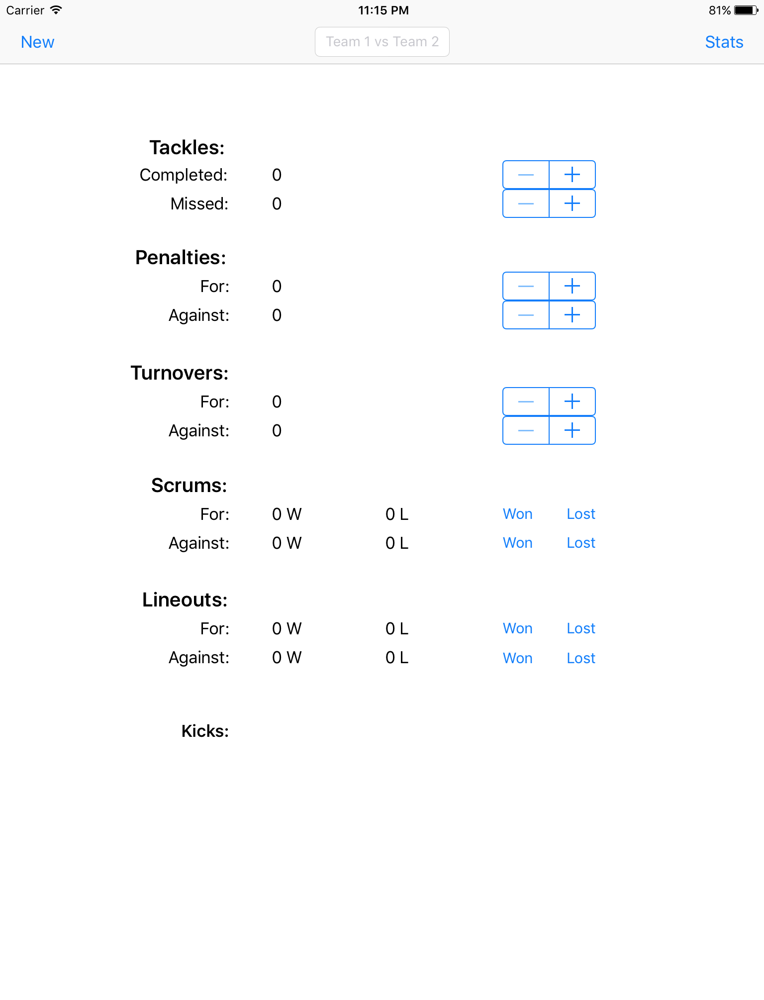
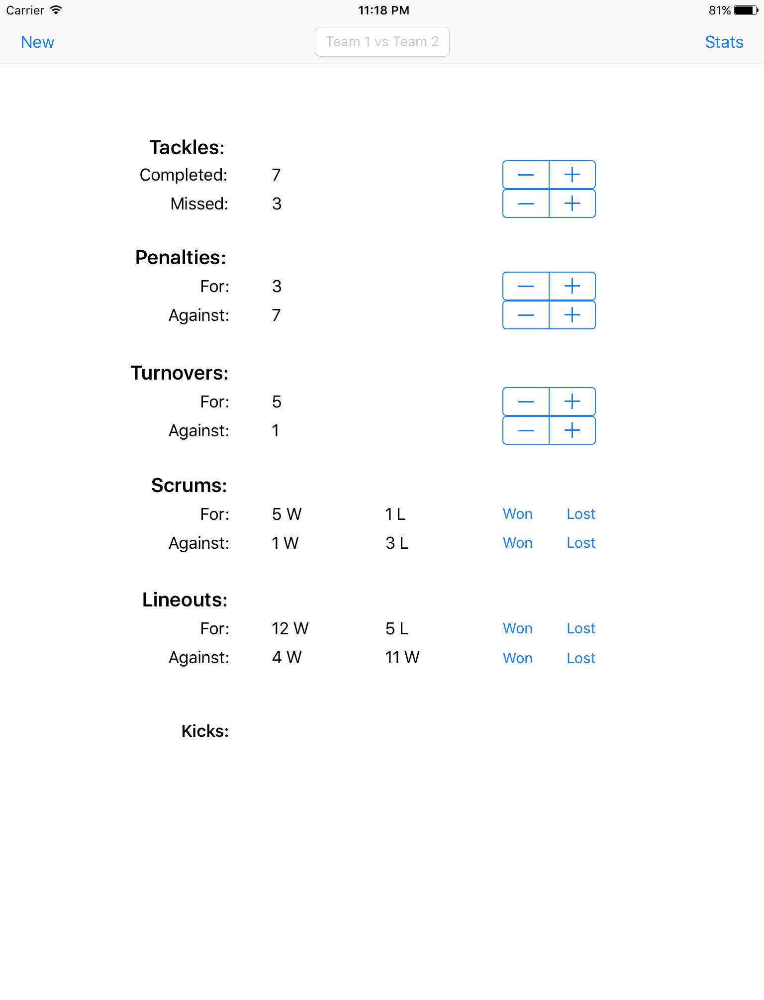
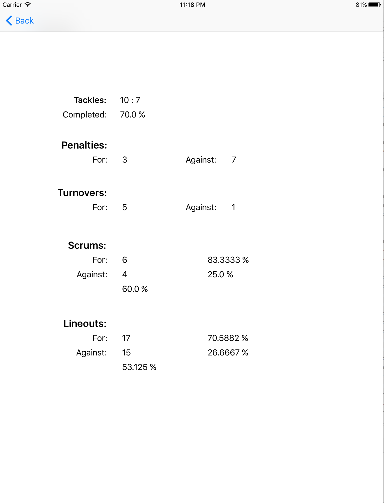

# Statistics

iOS app written in Swift designed to make taking statistics of rugby easier and more efficient.

## Screenshots
**New input screen**

**Sample filled out input screen**

**Sample output screen**

